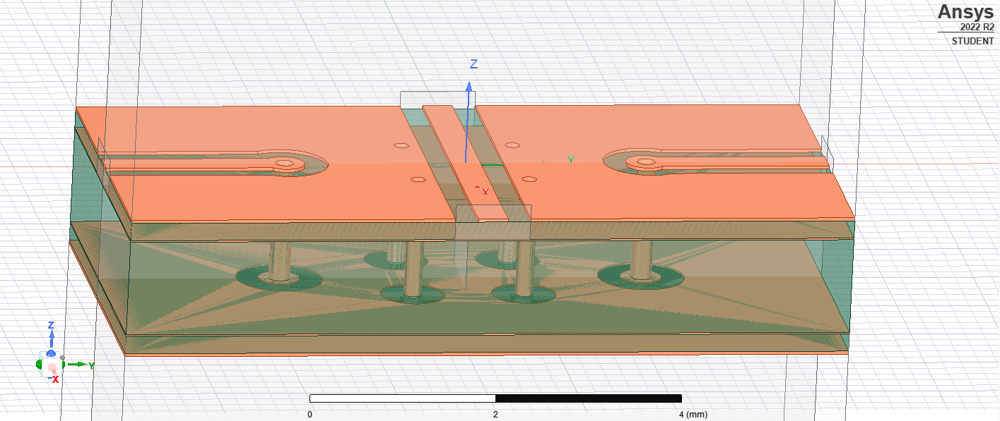

# Simulation of RF crossover

This is my first simulation in Ansys HFSS and there are some flaws I haven't fixed such as stub pads missing from the internal ground vias on the power plane.

A signal allows microwave traces to cross over each other by going through a via.

The properties of a good crossover are:

1. Good isolation between the traces crossing over
2. Low insertion loss for each of the traces

Vias are an issue as they present a discontinuity for the signal, and may result in an impedance mismatch resulting in increase in insertion loss and reflected power.

There is some amount of coupling between the two traces, which result in crosstalk.

I've made the following design considerations for manufacturing:

1. No blind vias or back-drilled vias. This is to reduce manufacturing cost and allow the device to be manufactured by JLCPCB.
2. JLCPCB 4 layer 7628 impedance controlled stackup
3. 1 - Ground/Signal plane, 2 - Ground plane, 3 - Power plane, 4 - Ground/Signal plane
4. 50 ohm impedance

I recommend you watch the following video series for an example of how to design a microwave crossover device in ansys. I used the series as a reference for my own design.

